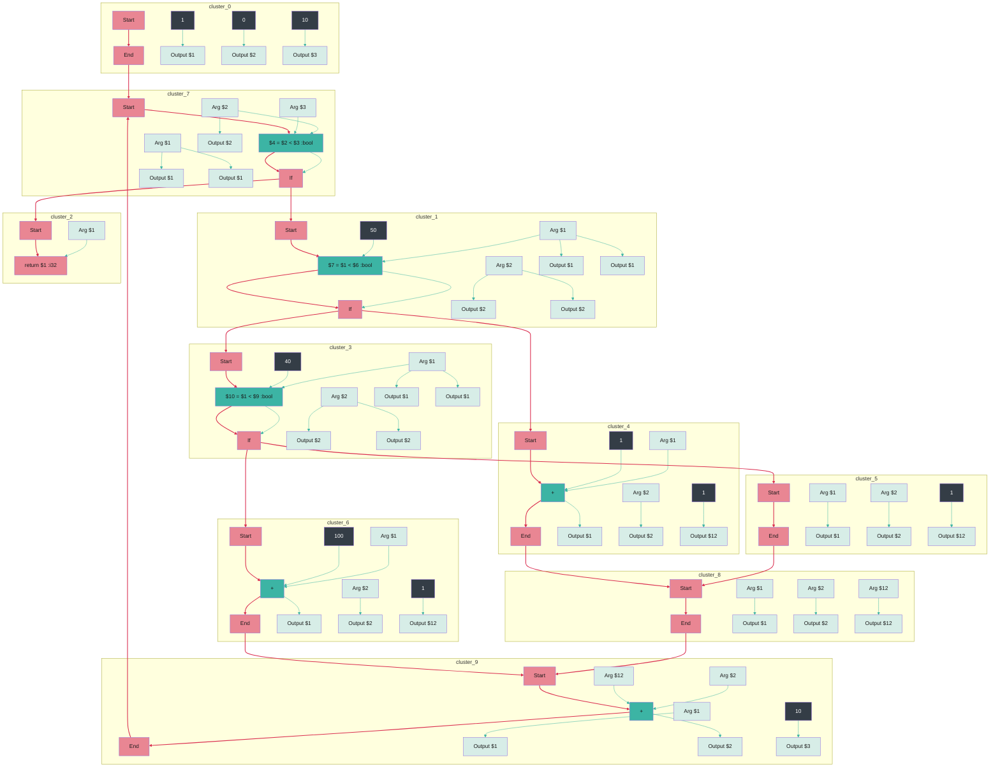

# Nautilus IR Graphs:

Nautilus support the vizualization of its intermediate representation using Graphviz or Marimaid:

```mermaid
  graph TD;
      A-->B;
      A-->C;
      B-->D;
      C-->D;
```

```mermaid
flowchart TD
  subgraph cluster_0 
   nodestart_0[Start]
  style nodestart_0 fill:#e98693,color:#1a1919
   node0_0[1]
  style node0_0 fill:#343d46,color:white
   node0_1[0]
  style node0_1 fill:#343d46,color:white
   node0_2[10]
  style node0_2 fill:#343d46,color:white
   node0_3[End]
  style node0_3 fill:#e98693,color:#1a1919
   node0_o4_0[Output $1 ]
  style node0_o4_0 fill:#d7ede7,color:#1a1919
   node0_o4_1[Output $2 ]
  style node0_o4_1 fill:#d7ede7,color:#1a1919
   node0_o4_2[Output $3 ]
  style node0_o4_2 fill:#d7ede7,color:#1a1919
  end
  subgraph cluster_7 
   nodestart_7[Start]
  style nodestart_7 fill:#e98693,color:#1a1919
   node7_5[Arg $1 ]
  style node7_5 fill:#d7ede7,color:#1a1919
   node7_6[Arg $2 ]
  style node7_6 fill:#d7ede7,color:#1a1919
   node7_7[Arg $3 ]
  style node7_7 fill:#d7ede7,color:#1a1919
   node7_8[$4 = $2 < $3 :bool]
  style node7_8 fill:#3cb4a4,color:#1a1919
   node7_9[If]
  style node7_9 fill:#e98693,color:#1a1919
   node7_o10_0[Output $1 ]
  style node7_o10_0 fill:#d7ede7,color:#1a1919
   node7_o10_1[Output $2 ]
  style node7_o10_1 fill:#d7ede7,color:#1a1919
   node7_o11_0[Output $1 ]
  style node7_o11_0 fill:#d7ede7,color:#1a1919
  end
  subgraph cluster_1 
   nodestart_1[Start]
  style nodestart_1 fill:#e98693,color:#1a1919
   node1_12[Arg $1 ]
  style node1_12 fill:#d7ede7,color:#1a1919
   node1_13[Arg $2 ]
  style node1_13 fill:#d7ede7,color:#1a1919
   node1_14[50]
  style node1_14 fill:#343d46,color:white
   node1_15[$7 = $1 < $6 :bool]
  style node1_15 fill:#3cb4a4,color:#1a1919
   node1_16[If]
  style node1_16 fill:#e98693,color:#1a1919
   node1_o17_0[Output $1 ]
  style node1_o17_0 fill:#d7ede7,color:#1a1919
   node1_o17_1[Output $2 ]
  style node1_o17_1 fill:#d7ede7,color:#1a1919
   node1_o18_0[Output $2 ]
  style node1_o18_0 fill:#d7ede7,color:#1a1919
   node1_o18_1[Output $1 ]
  style node1_o18_1 fill:#d7ede7,color:#1a1919
  end
  subgraph cluster_3 
   nodestart_3[Start]
  style nodestart_3 fill:#e98693,color:#1a1919
   node3_19[Arg $1 ]
  style node3_19 fill:#d7ede7,color:#1a1919
   node3_20[Arg $2 ]
  style node3_20 fill:#d7ede7,color:#1a1919
   node3_21[40]
  style node3_21 fill:#343d46,color:white
   node3_22[$10 = $1 < $9 :bool]
  style node3_22 fill:#3cb4a4,color:#1a1919
   node3_23[If]
  style node3_23 fill:#e98693,color:#1a1919
   node3_o24_0[Output $1 ]
  style node3_o24_0 fill:#d7ede7,color:#1a1919
   node3_o24_1[Output $2 ]
  style node3_o24_1 fill:#d7ede7,color:#1a1919
   node3_o25_0[Output $2 ]
  style node3_o25_0 fill:#d7ede7,color:#1a1919
   node3_o25_1[Output $1 ]
  style node3_o25_1 fill:#d7ede7,color:#1a1919
  end
  subgraph cluster_5 
   nodestart_5[Start]
  style nodestart_5 fill:#e98693,color:#1a1919
   node5_26[Arg $1 ]
  style node5_26 fill:#d7ede7,color:#1a1919
   node5_27[Arg $2 ]
  style node5_27 fill:#d7ede7,color:#1a1919
   node5_28[1]
  style node5_28 fill:#343d46,color:white
   node5_29[End]
  style node5_29 fill:#e98693,color:#1a1919
   node5_o30_0[Output $1 ]
  style node5_o30_0 fill:#d7ede7,color:#1a1919
   node5_o30_1[Output $2 ]
  style node5_o30_1 fill:#d7ede7,color:#1a1919
   node5_o30_2[Output $12 ]
  style node5_o30_2 fill:#d7ede7,color:#1a1919
  end
  subgraph cluster_8 
   nodestart_8[Start]
  style nodestart_8 fill:#e98693,color:#1a1919
   node8_31[Arg $1 ]
  style node8_31 fill:#d7ede7,color:#1a1919
   node8_32[Arg $2 ]
  style node8_32 fill:#d7ede7,color:#1a1919
   node8_33[Arg $12 ]
  style node8_33 fill:#d7ede7,color:#1a1919
   node8_34[End]
  style node8_34 fill:#e98693,color:#1a1919
   node8_o35_0[Output $1 ]
  style node8_o35_0 fill:#d7ede7,color:#1a1919
   node8_o35_1[Output $2 ]
  style node8_o35_1 fill:#d7ede7,color:#1a1919
   node8_o35_2[Output $12 ]
  style node8_o35_2 fill:#d7ede7,color:#1a1919
  end
  subgraph cluster_9 
   nodestart_9[Start]
  style nodestart_9 fill:#e98693,color:#1a1919
   node9_36[Arg $1 ]
  style node9_36 fill:#d7ede7,color:#1a1919
   node9_37[Arg $2 ]
  style node9_37 fill:#d7ede7,color:#1a1919
   node9_38[Arg $12 ]
  style node9_38 fill:#d7ede7,color:#1a1919
   node9_39[+]
  style node9_39 fill:#3cb4a4,color:#1a1919
   node9_40[10]
  style node9_40 fill:#343d46,color:white
   node9_41[End]
  style node9_41 fill:#e98693,color:#1a1919
   node9_o42_0[Output $1 ]
  style node9_o42_0 fill:#d7ede7,color:#1a1919
   node9_o42_1[Output $2 ]
  style node9_o42_1 fill:#d7ede7,color:#1a1919
   node9_o42_2[Output $3 ]
  style node9_o42_2 fill:#d7ede7,color:#1a1919
  end
  subgraph cluster_6 
   nodestart_6[Start]
  style nodestart_6 fill:#e98693,color:#1a1919
   node6_43[Arg $2 ]
  style node6_43 fill:#d7ede7,color:#1a1919
   node6_44[Arg $1 ]
  style node6_44 fill:#d7ede7,color:#1a1919
   node6_45[100]
  style node6_45 fill:#343d46,color:white
   node6_46[+]
  style node6_46 fill:#3cb4a4,color:#1a1919
   node6_47[1]
  style node6_47 fill:#343d46,color:white
   node6_48[End]
  style node6_48 fill:#e98693,color:#1a1919
   node6_o49_0[Output $1 ]
  style node6_o49_0 fill:#d7ede7,color:#1a1919
   node6_o49_1[Output $2 ]
  style node6_o49_1 fill:#d7ede7,color:#1a1919
   node6_o49_2[Output $12 ]
  style node6_o49_2 fill:#d7ede7,color:#1a1919
  end
  subgraph cluster_4 
   nodestart_4[Start]
  style nodestart_4 fill:#e98693,color:#1a1919
   node4_50[Arg $2 ]
  style node4_50 fill:#d7ede7,color:#1a1919
   node4_51[Arg $1 ]
  style node4_51 fill:#d7ede7,color:#1a1919
   node4_52[1]
  style node4_52 fill:#343d46,color:white
   node4_53[+]
  style node4_53 fill:#3cb4a4,color:#1a1919
   node4_54[1]
  style node4_54 fill:#343d46,color:white
   node4_55[End]
  style node4_55 fill:#e98693,color:#1a1919
   node4_o56_0[Output $1 ]
  style node4_o56_0 fill:#d7ede7,color:#1a1919
   node4_o56_1[Output $2 ]
  style node4_o56_1 fill:#d7ede7,color:#1a1919
   node4_o56_2[Output $12 ]
  style node4_o56_2 fill:#d7ede7,color:#1a1919
  end
  subgraph cluster_2 
   nodestart_2[Start]
  style nodestart_2 fill:#e98693,color:#1a1919
   node2_57[Arg $1 ]
  style node2_57 fill:#d7ede7,color:#1a1919
   node2_58[return  $1  :i32]
  style node2_58 fill:#e98693,color:#1a1919
  end
  node0_0 --> node0_o4_0
  linkStyle 0 stroke:#3cb4a4,stroke-width:1px
  node0_1 --> node0_o4_1
  linkStyle 1 stroke:#3cb4a4,stroke-width:1px
  node0_2 --> node0_o4_2
  linkStyle 2 stroke:#3cb4a4,stroke-width:1px
  node7_6 --> node7_8
  linkStyle 3 stroke:#3cb4a4,stroke-width:1px
  node7_7 --> node7_8
  linkStyle 4 stroke:#3cb4a4,stroke-width:1px
  node7_8 --> node7_9
  linkStyle 5 stroke:#3cb4a4,stroke-width:1px
  node7_5 --> node7_o10_0
  linkStyle 6 stroke:#3cb4a4,stroke-width:1px
  node7_6 --> node7_o10_1
  linkStyle 7 stroke:#3cb4a4,stroke-width:1px
  node7_5 --> node7_o11_0
  linkStyle 8 stroke:#3cb4a4,stroke-width:1px
  node1_12 --> node1_15
  linkStyle 9 stroke:#3cb4a4,stroke-width:1px
  node1_14 --> node1_15
  linkStyle 10 stroke:#3cb4a4,stroke-width:1px
  node1_15 --> node1_16
  linkStyle 11 stroke:#3cb4a4,stroke-width:1px
  node1_12 --> node1_o17_0
  linkStyle 12 stroke:#3cb4a4,stroke-width:1px
  node1_13 --> node1_o17_1
  linkStyle 13 stroke:#3cb4a4,stroke-width:1px
  node1_13 --> node1_o18_0
  linkStyle 14 stroke:#3cb4a4,stroke-width:1px
  node1_12 --> node1_o18_1
  linkStyle 15 stroke:#3cb4a4,stroke-width:1px
  node3_19 --> node3_22
  linkStyle 16 stroke:#3cb4a4,stroke-width:1px
  node3_21 --> node3_22
  linkStyle 17 stroke:#3cb4a4,stroke-width:1px
  node3_22 --> node3_23
  linkStyle 18 stroke:#3cb4a4,stroke-width:1px
  node3_19 --> node3_o24_0
  linkStyle 19 stroke:#3cb4a4,stroke-width:1px
  node3_20 --> node3_o24_1
  linkStyle 20 stroke:#3cb4a4,stroke-width:1px
  node3_20 --> node3_o25_0
  linkStyle 21 stroke:#3cb4a4,stroke-width:1px
  node3_19 --> node3_o25_1
  linkStyle 22 stroke:#3cb4a4,stroke-width:1px
  node5_26 --> node5_o30_0
  linkStyle 23 stroke:#3cb4a4,stroke-width:1px
  node5_27 --> node5_o30_1
  linkStyle 24 stroke:#3cb4a4,stroke-width:1px
  node5_28 --> node5_o30_2
  linkStyle 25 stroke:#3cb4a4,stroke-width:1px
  node8_31 --> node8_o35_0
  linkStyle 26 stroke:#3cb4a4,stroke-width:1px
  node8_32 --> node8_o35_1
  linkStyle 27 stroke:#3cb4a4,stroke-width:1px
  node8_33 --> node8_o35_2
  linkStyle 28 stroke:#3cb4a4,stroke-width:1px
  node9_37 --> node9_39
  linkStyle 29 stroke:#3cb4a4,stroke-width:1px
  node9_38 --> node9_39
  linkStyle 30 stroke:#3cb4a4,stroke-width:1px
  node9_36 --> node9_o42_0
  linkStyle 31 stroke:#3cb4a4,stroke-width:1px
  node9_39 --> node9_o42_1
  linkStyle 32 stroke:#3cb4a4,stroke-width:1px
  node9_40 --> node9_o42_2
  linkStyle 33 stroke:#3cb4a4,stroke-width:1px
  node6_44 --> node6_46
  linkStyle 34 stroke:#3cb4a4,stroke-width:1px
  node6_45 --> node6_46
  linkStyle 35 stroke:#3cb4a4,stroke-width:1px
  node6_46 --> node6_o49_0
  linkStyle 36 stroke:#3cb4a4,stroke-width:1px
  node6_43 --> node6_o49_1
  linkStyle 37 stroke:#3cb4a4,stroke-width:1px
  node6_47 --> node6_o49_2
  linkStyle 38 stroke:#3cb4a4,stroke-width:1px
  node4_51 --> node4_53
  linkStyle 39 stroke:#3cb4a4,stroke-width:1px
  node4_52 --> node4_53
  linkStyle 40 stroke:#3cb4a4,stroke-width:1px
  node4_53 --> node4_o56_0
  linkStyle 41 stroke:#3cb4a4,stroke-width:1px
  node4_50 --> node4_o56_1
  linkStyle 42 stroke:#3cb4a4,stroke-width:1px
  node4_54 --> node4_o56_2
  linkStyle 43 stroke:#3cb4a4,stroke-width:1px
  node2_57 --> node2_58
  linkStyle 44 stroke:#3cb4a4,stroke-width:1px
  nodestart_0 --> node0_3
  linkStyle 45 stroke:#da2d4f,stroke-width:2px
  node0_3 --> nodestart_7
  linkStyle 46 stroke:#da2d4f,stroke-width:2px
  nodestart_7 --> node7_8
  linkStyle 47 stroke:#da2d4f,stroke-width:2px
  node7_8 --> node7_9
  linkStyle 48 stroke:#da2d4f,stroke-width:2px
  node7_9 --> nodestart_1
  linkStyle 49 stroke:#da2d4f,stroke-width:2px
  node7_9 --> nodestart_2
  linkStyle 50 stroke:#da2d4f,stroke-width:2px
  nodestart_1 --> node1_15
  linkStyle 51 stroke:#da2d4f,stroke-width:2px
  node1_15 --> node1_16
  linkStyle 52 stroke:#da2d4f,stroke-width:2px
  node1_16 --> nodestart_3
  linkStyle 53 stroke:#da2d4f,stroke-width:2px
  node1_16 --> nodestart_4
  linkStyle 54 stroke:#da2d4f,stroke-width:2px
  nodestart_3 --> node3_22
  linkStyle 55 stroke:#da2d4f,stroke-width:2px
  node3_22 --> node3_23
  linkStyle 56 stroke:#da2d4f,stroke-width:2px
  node3_23 --> nodestart_5
  linkStyle 57 stroke:#da2d4f,stroke-width:2px
  node3_23 --> nodestart_6
  linkStyle 58 stroke:#da2d4f,stroke-width:2px
  nodestart_5 --> node5_29
  linkStyle 59 stroke:#da2d4f,stroke-width:2px
  node5_29 --> nodestart_8
  linkStyle 60 stroke:#da2d4f,stroke-width:2px
  nodestart_8 --> node8_34
  linkStyle 61 stroke:#da2d4f,stroke-width:2px
  node8_34 --> nodestart_9
  linkStyle 62 stroke:#da2d4f,stroke-width:2px
  nodestart_9 --> node9_39
  linkStyle 63 stroke:#da2d4f,stroke-width:2px
  node9_39 --> node9_41
  linkStyle 64 stroke:#da2d4f,stroke-width:2px
  node9_41 --> nodestart_7
  linkStyle 65 stroke:#da2d4f,stroke-width:2px
  nodestart_6 --> node6_46
  linkStyle 66 stroke:#da2d4f,stroke-width:2px
  node6_46 --> node6_48
  linkStyle 67 stroke:#da2d4f,stroke-width:2px
  node6_48 --> nodestart_9
  linkStyle 68 stroke:#da2d4f,stroke-width:2px
  nodestart_4 --> node4_53
  linkStyle 69 stroke:#da2d4f,stroke-width:2px
  node4_53 --> node4_55
  linkStyle 70 stroke:#da2d4f,stroke-width:2px  
  node4_55 --> nodestart_8
  linkStyle 71 stroke:#da2d4f,stroke-width:2px
  nodestart_2 --> node2_58
  linkStyle 72 stroke:#da2d4f,stroke-width:2px
```