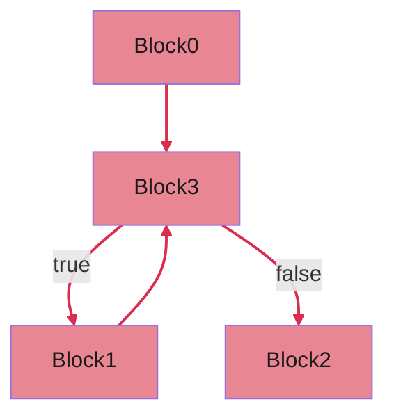
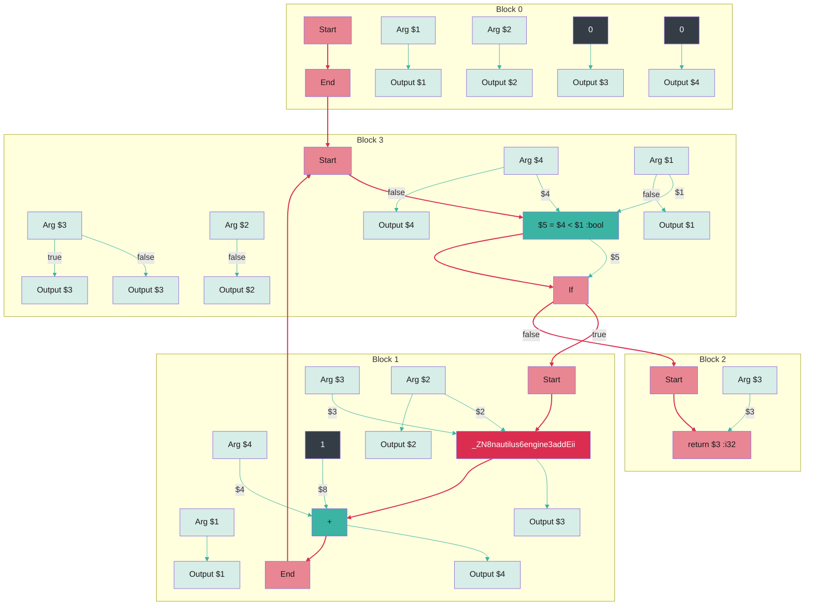

# Nautilus IR Graphs:

Nautilus supports the vizualization of its intermediate representation using Graphviz or Marimaid:

## Options:

| Option                             | Default  | Description                                                                              |
|------------------------------------|----------|------------------------------------------------------------------------------------------|
| dump.graph=[true,false]            | false    | Dumps a graph representation in either (mermaid or graphvit) to a file.                  |
| dump.graph.type=[mermaid,graphviz] | graphviz | Sets the type of the graph.                                                              |
| dump.graph.full=[true,false]       | false    | Represents both data and control-flow (full=true) or only the control-flow (full=false). |

### Example Nautilus Function:

A simple nautilus function that invokes a native add function for each loop iteration and calculates a final sum.

```Cpp
val<int32_t> loopDirectCall(val<int32_t> c, val<int32_t> x) {
 val<int32_t> sum = 0;
 for (val<int32_t> i = 0; i < c; i = i + 1) {
    sum = invoke<>(add, sum, x);
 }
 return sum;
}
```

Resulting Nautilus IR:

```
NautilusIr {
execute() {
Block_0($1:i32, $2:i32):
	$3 = 0 :i32
	$4 = 0 :i32
	br Block_3($3, $4, $1, $2) :void

Block_3($3:i32, $4:i32, $1:i32, $2:i32):
	$5 = $4 < $1 :bool
	if $5 ? Block_1($1, $4, $3, $2) : Block_2($3) :void

Block_1($1:i32, $4:i32, $3:i32, $2:i32):
	$7 = _ZN8nautilus6engine3addEii($3,$2) :i32
	$8 = 1 :i32
	$9 = $4 + $8 :i32
	br Block_3($7, $9, $1, $2) :void

Block_2($3:i32):
	return ($3) :i32
}
} 
 ```

## Control-flow Graph

If `dump.graph.full=false` nautilus dumps only the control-flow graph.
For the example function, the IR consists of three basic blocks.  
`Block 0` is the function entry, `Block 3` is the loop head, `Block 1` the loop body, and `Block 2` is the final return
block.
This representation is very useful to inspect the connection between individual basic blocks.



## Data/Control-flow Graph

If `dump.graph.full=true` nautilus dumps the complete data and control-flow graph.
This representation contains all IR nodes and represents the data and control dependencies between individual nodes.
In this case we can see in `Block 3` the loop condition `$5 = $4 < $1 :bool` and the invocation of the `add` function
in `Block 1`.

