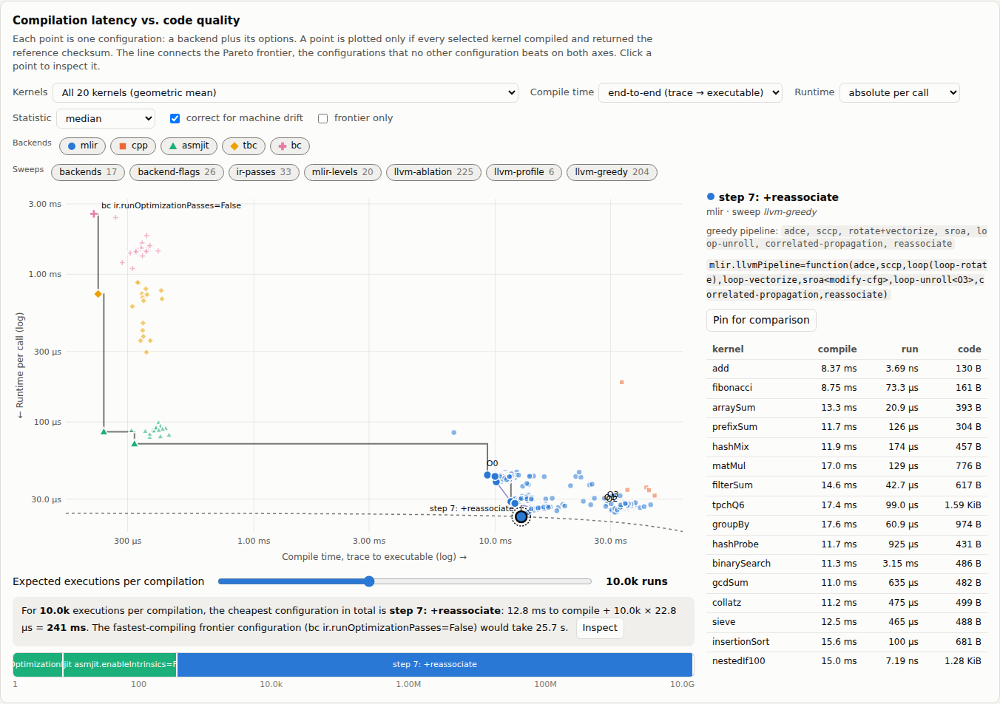
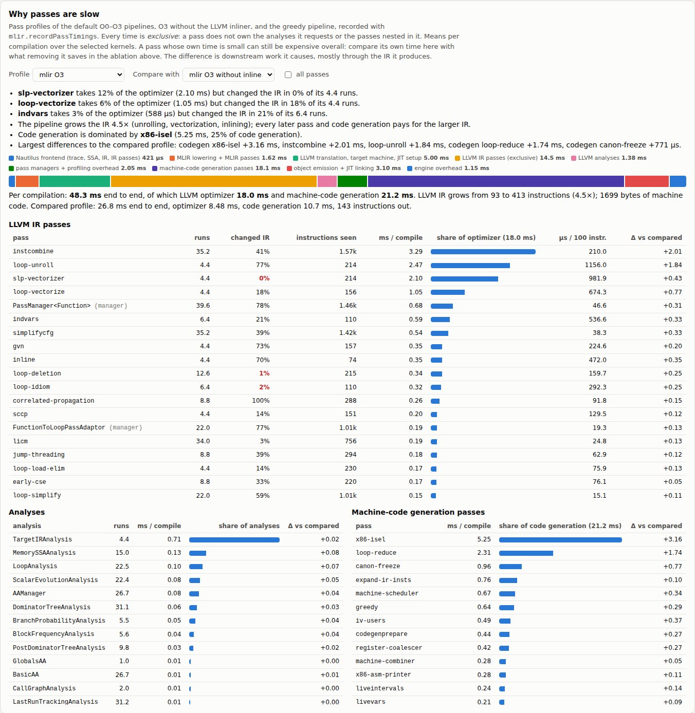

# Backend explorer

Measures how Nautilus' compilation backends and their options trade **compilation latency** for **code quality**.
It answers questions like:

- Which backend configurations are on the Pareto frontier of compile time vs. runtime?
- For a kernel that runs *N* times per compilation, which configuration minimizes the total cost?
- What does each LLVM pass cost in compile time, and what does it buy in runtime?
- Which small LLVM pipeline gets most of `-O3`'s code quality for a fraction of its compile time?





## Quick start

```bash
# 1. Build the runner with Clang (Release, so the measured compile times are representative).
#    It is opt-in and not part of any default or CI build.
cmake -B build -G Ninja -DCMAKE_BUILD_TYPE=Release \
      -DCMAKE_CXX_COMPILER=clang++-21 -DCMAKE_C_COMPILER=clang-21 \
      -DENABLE_BACKEND_EXPLORER=ON
cmake --build build --target nautilus-backend-explorer

# 2. Measure and render (1-2 hours for the full default sweep; resumable)
tools/backend-explorer/explore.py run --out results.json --report report.html

# A first look in a few minutes: 1 process, 2 compiles, 3 samples per point, 10 kernels
tools/backend-explorer/explore.py run --quick --out quick.json --report quick.html
```

Open `report.html` in a browser. It is self-contained (no network access needed), so it can be attached to an issue or
shared as is.

## How it works

```
explore.py run ──► nautilus-backend-explorer --backend B --opt k=v ...   (one process per configuration)
                     │  for each kernel in BenchmarkKernels.hpp:
                     │    compile N times   → wall time + CompilationStatistics (per-phase timings, code size)
                     │    run (calibrated)  → time per call, checksum
                     ▼
                   one JSON line per kernel
explore.py         ──► results.json (appended, resumable) ──► explore.py report ──► report.html
```

- **Kernels** (`runner/BenchmarkKernels.hpp`): 20 kernels in four categories: *micro*
  (arithmetic and memory loops), *query* (filter/aggregate, TPC-H Q6, group-by, hash-join probe, binary search),
  *control-flow* (data-dependent loops, sorting, 100-deep if-chains), and *calls* (internal and external calls). Each
  returns a checksum. A configuration whose checksum differs from the default MLIR backend's is reported as a wrong
  result and left out of the frontier. This matters for pass ablations, which can expose miscompilations.
- **Compile time** is the median wall time of a full compile: trace → SSA → Nautilus IR → IR passes → backend →
  executable. For MLIR, `mlir.eager_compilation` is set so machine code is generated inside the compile. Otherwise
  that would happen lazily on the first call.
- **Runtime** is the median time per call over up to `--samples` samples. Each sample runs a batch of calls calibrated
  to last about `--sample-ms`.
- **Processes**: every configuration is measured in `--process-reps` (default 3) independent processes, and their
  samples are pooled. Code and data placement differ per process and can shift one kernel's runtime by tens of
  percent with identical code. One process measures one draw of that layout, not the configuration. A kernel whose
  checksum differs between processes is reported as *nondeterministic*.
- **Machine drift**: a long sweep cannot assume the machine runs at a constant speed. On a cloud VM, code that
  compiled to identical machine code measured 20–25% faster two hours later. Every `--reference-every` (default 4)
  measured configurations, the driver re-measures a reference (mlir O3 with default options). The report divides
  each result by the reference's slowdown at the time it was measured, interpolated between reference measurements
  (toggle "correct for machine drift"), and shows the reference timeline under the measurement settings. The greedy
  search decides on corrected values. Without the correction, it preferred whichever candidate ran while the machine
  was fast: it once selected `slp-vectorizer`, a pass that never changed the IR.
- **Aggregates** over several kernels are geometric means, so every kernel weighs the same regardless of its absolute
  runtime.
- **Crashes**: each configuration runs in its own process. If the process dies, the remaining kernels are retried one
  per process, so the crashing kernel is identified and the others are still measured.

## Sweeps

| Sweep | What varies |
|-------|-------------|
| `backends` | Every backend at its defaults, plus the cpp backend at `-O1..3` (`cpp.optimizationLevel`, `cpp.nativeArch`) and the tuned configurations `ExecutionBenchmark.cpp` tracks |
| `backend-flags` | One backend flag at a time (`asmjit.*`, `bc.*`, `tbc.*`, `mlir.inliner`, ...) |
| `ir-passes` | Nautilus' own IR pipeline: all on/off per backend, then each pass toggled on asmjit and bc |
| `mlir-levels` | LLVM IR optimization level (`optimizationLevel`) × machine-code generation level (`mlir.codegenOptLevel`), and the MLIR inliner off |
| `llvm-ablation` | Leave-one-out over the expanded LLVM pipeline: for each distinct pass, the pipeline without any instance of it (`--ablation-levels 2,3`) |
| `llvm-profile` | The default O0–O3 pipelines, O3 without the LLVM inliner, and (after `llvm-greedy`) the greedy pipeline, profiled with `mlir.recordPassTimings`: each LLVM pass's exclusive time, runs, runs that changed the IR and instructions processed; each analysis; each machine-code generation pass |
| `llvm-greedy` | *(opt-in)* Forward selection: starting from an empty pipeline, repeatedly append the pass with the best runtime gain per millisecond of compile time (`--greedy-steps`, `--greedy-min-gain`) |

`--ablation-levels` defaults to `0,1,2,3`. `all` (the default) runs every sweep except `llvm-greedy`, which evaluates about 30 candidates per step:

```bash
explore.py run --out results.json --sweep all --sweep llvm-greedy
explore.py run --out results.json --sweep llvm-greedy --kernel tpchQ6 --kernel hashProbe --kernel matMul
```

To add your own configurations, use `--config-file`:

```json
[
  {"label": "mlir O2, no unrolling", "backend": "mlir",
   "stringOptions": {"mlir.llvmPipeline": "default<O2>"}, "options": {"mlir.codegenOptLevel": 1}}
]
```

`--opt key=value` applies an option to every configuration (e.g. `--opt mlir.enableMultithreading=false`).

## The MLIR/LLVM options this relies on

The MLIR backend's own MLIR passes are the inliner and the lowering to the LLVM dialect. The optimization happens in
LLVM, so passes are studied at that level:

- `mlir.llvmPipeline`: a textual new-pass-manager pipeline (`opt -passes=` syntax) that replaces the
  `optimizationLevel` pipeline.
- `mlir.recordLLVMPipeline`: records the expanded pipeline text under the `llvm.pipeline` statistic.
  `explore.py pipeline --level 3 --tree` prints it. Feeding it back through `mlir.llvmPipeline` reproduces the
  default pipeline exactly; the ablation baseline is that expanded pipeline.
- `mlir.codegenOptLevel`, `mlir.inliner`: machine-code generation level and the MLIR inliner.
- Statistics: `llvm.optimize.ms`, `jit.codegen.ms`, `jit.code.bytes`, `llvm.ir.instructions.before/after`.

See `docs/options.md` for the full option reference.

## Reading the report

- **Frontier chart**: compile time (x) vs. runtime (y), both on log scales. Colour and marker shape both identify the
  backend. The staircase is the Pareto frontier. Filter by kernel or kernel category, backend, and sweep.
- **Expected executions**: the slider sets *N*, the number of calls per compilation. The dashed curve passes through
  every point with the same total cost (compile + *N* × runtime) as the cheapest configuration, which is circled. The
  bar below shows which frontier configuration is cheapest for every *N* from 1 to 10¹⁰. That gives the break-even
  points for tiered compilation.
- **Where compilation time goes**: compile phases (tracing, IR passes, lowering, LLVM optimization, code generation,
  ...) for the selected and frontier configurations.
- **LLVM pass ablation**: the change in compile and run time from removing each pass, at each default level. The
  table is sortable and names the kernel that suffers most. *Own time* is the pass's exclusive time in the profile;
  *indirect* is the rest of the saving: work later passes and code generation do because of what the pass produced.
- **Why passes are slow**: a pass profile per default level, with a compare mode. It shows where one compilation's
  time goes (frontend, MLIR, LLVM setup, passes, analyses, pass managers, code generation passes, object emission and
  linking) and how much the IR grows. It lists passes by exclusive time, how often they changed the IR, and µs per 100
  instructions processed, plus tables of analyses and code generation passes. Findings it derives automatically
  include passes that cost time without changing the IR.
- **Greedy pipeline construction**: the passes the search selected and the cost/quality after each step.
- **All configurations**: the table view; filterable and sortable.

## Measurement hygiene

Results are only as stable as the machine:

- Pin the runner to one core with `--cpu 3`.
- Use the `performance` governor. The report warns when it is not.
- Close other workloads, and compare results only from the same machine and commit. Both are recorded in the report
  header.
- Layout effects are the largest source of runtime noise: with one process per configuration, removing a pass that
  cannot change the code still moved single kernels by up to 40% on a cloud VM. Keep `--process-reps` at 3 or more
  when comparing small differences. The report's *best repetition* statistic is the least sensitive to interference
  from other processes. The greedy search uses that statistic too.
- The compile-time spread between repetitions is typically a few percent. Ablating a pass that costs less than that is
  within noise. Raise `--compile-reps` to resolve it.

## Tests

```bash
python3 -m unittest discover tools/backend-explorer
```
